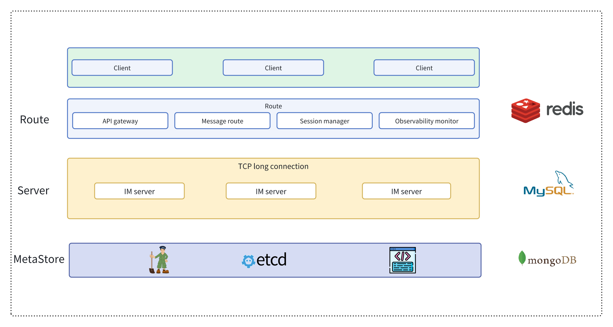
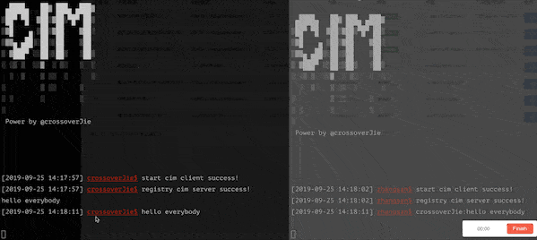

<div align="center">  

 
<br/>

[](https://codecov.io/gh/crossoverJie/cim)
[](https://github.com/crossoverJie/cim)
[](https://juejin.im/post/5c2bffdc51882509181395d7)

📘[介绍](#介绍) |📽[视频演示](#视频演示) | 🏖[TODO LIST](#todo-list) | 🌈[系统架构](#系统架构) |💡[流程图](#流程图)|🌁[快速启动](#快速启动)|👨🏻‍✈️[内置命令](#客户端内置命令)|🎤[通信](#群聊私聊)|❓[QA](https://github.com/crossoverJie/cim/blob/master/doc/QA.md)|💌[联系作者](#联系作者)


</div>
<br/>

# V2.0
- [x] Upgrade to JDK17 & springboot3.0 
- [x] Client SDK 
- [ ] Client use [picocli](https://picocli.info/) instead of springboot.
- [x] Support integration testing.
- [ ] Integrate OpenTelemetry .
- [ ] Support single node startup(Contains no components).
- [ ] Third-party components support replacement(Redis/Zookeeper, etc.).
- [ ] Support web client(websocket).
- [x] Support docker container.
- [ ] Support kubernetes operation.
- [ ] Supports binary client(build with golang).

## Introduction

`CIM(CROSS-IM)` is an `IM (instant messaging)` system for developers; it also provides some components to help developers build their own scalable `IM`.
Using `CIM`, you can achieve the following requirements:
- `IM` instant messaging system.
- Message push middleware for `APP`.
- Message middleware for `IOT` massive connection scenarios.

> If you have any questions during use or development, you can [contact me](#联系作者).

## 视频演示

> 点击下方链接可以查看视频版 Demo。

| YouTube | Bilibili|
| :------:| :------: | 
| [群聊](https://youtu.be/_9a4lIkQ5_o) [私聊](https://youtu.be/kfEfQFPLBTQ) | [群聊](https://www.bilibili.com/video/av39405501) [私聊](https://www.bilibili.com/video/av39405821) | 
|   | 


## TODO LIST

* [x] [群聊](#群聊)
* [x] [私聊](#私聊)
* [x] [内置命令](#客户端内置命令)
* [x] [聊天记录查询](#聊天记录查询)。
* [x] [一键开启价值 2 亿的 `AI` 模式](#ai-模式)
* [x] 使用 `Google Protocol Buffer` 高效编解码
* [x] 根据实际情况灵活的水平扩容、缩容
* [x] 服务端自动剔除离线客户端
* [x] 客户端自动重连
* [x] [延时消息](#延时消息)
* [x] SDK 开发包
* [ ] 分组群聊
* [ ] 离线消息
* [ ] 消息加密


## Architecture



- Each component in `CIM` is built using `SpringBoot`
  - Client build with [cim-client-sdk](https://github.com/crossoverJie/cim/tree/master/cim-client-sdk)
- Use `Netty` to build the underlying communication.
- `MetaStore` is used for registration and discovery of `IM-server` services.


### cim-server
IM server is used to receive client connections, message forwarding, message push, etc.
Support cluster deployment.

### cim-route

Route server; used to process message routing, message forwarding, user login, user offline, and some operation tools (get the number of online users, etc.).

### cim-client
IM client terminal, a command can be started and initiated to communicate with others (group chat, private chat).

## Flow Chart


- Server register to `MetaStore`
- Route subscribe `MetaStore`
- Client login to Route
  - Route get Server info from `MetaStore`
- Client open connection to Server
- Client1 send message to Route
- Route select Server and forward message to Server
- Server push message to Client2


## Quick start

Use allin1 docker to start the server:

```shell
docker pull crossoverjie/cim-allin1:latest
docker run -p 2181:2181 -p 6379:6379 -p 8083:8083 --rm --name cim-allin1  crossoverjie/cim-allin1:latest
```

### Build in local
```shell

首先需要安装 `Zookeeper、Redis` 并保证网络通畅。

```shell
docker run --rm --name zookeeper -d -p 2181:2181 zookeeper:3.9.2
docker run --rm --name redis -d -p 6379:6379 redis:7.4.0
```

```shell
git clone https://github.com/crossoverJie/cim.git
cd cim
mvn clean install -DskipTests=true
cd cim-server && cim-client && cim-forward-route
mvn clean package spring-boot:repackage -DskipTests=true
```

### 部署 IM-server(cim-server)

```shell
cp /cim/cim-server/target/cim-server-1.0.0-SNAPSHOT.jar /xx/work/server0/
cd /xx/work/server0/
nohup java -jar  /root/work/server0/cim-server-1.0.0-SNAPSHOT.jar --cim.server.port=9000 --app.zk.addr=zk地址  > /root/work/server0/log.file 2>&1 &
```

> cim-server 集群部署同理，只要保证 Zookeeper 地址相同即可。

### 部署路由服务器(cim-forward-route)

```shell
cp /cim/cim-server/cim-forward-route/target/cim-forward-route-1.0.0-SNAPSHOT.jar /xx/work/route0/
cd /xx/work/route0/
nohup java -jar  /root/work/route0/cim-forward-route-1.0.0-SNAPSHOT.jar --app.zk.addr=zk地址 --spring.redis.host=redis地址 --spring.redis.port=6379  > /root/work/route/log.file 2>&1 &
```

> cim-forward-route 本身就是无状态，可以部署多台；使用 Nginx 代理即可。


### 启动客户端

```shell
cp /cim/cim-client/target/cim-client-1.0.0-SNAPSHOT.jar /xx/work/route0/
cd /xx/work/route0/
java -jar cim-client-1.0.0-SNAPSHOT.jar --server.port=8084 --cim.user.id=唯一客户端ID --cim.user.userName=用户名 --cim.route.url=http://路由服务器:8083/
```


如上图，启动两个客户端可以互相通信即可。

### 本地启动客户端

#### 注册账号
```shell
curl -X POST --header 'Content-Type: application/json' --header 'Accept: application/json' -d '{
  "reqNo": "1234567890",
  "timeStamp": 0,
  "userName": "zhangsan"
}' 'http://路由服务器:8083/registerAccount'
```

从返回结果中获取 `userId`

```json
{
    "code":"9000",
    "message":"成功",
    "reqNo":null,
    "dataBody":{
        "userId":1547028929407,
        "userName":"test"
    }
}
```

#### 启动本地客户端
```shell
# 启动本地客户端
cp /cim/cim-client/target/cim-client-1.0.0-SNAPSHOT.jar /xx/work/route0/
cd /xx/work/route0/
java -jar cim-client-1.0.0-SNAPSHOT.jar --server.port=8084 --cim.user.id=上方返回的userId --cim.user.userName=用户名 --cim.route.url=http://路由服务器:8083/
```

## 客户端内置命令

| 命令 | 描述|
| ------ | ------ | 
| `:q!` | 退出客户端| 
| `:olu` | 获取所有在线用户信息 | 
| `:all` | 获取所有命令 | 
| `:q [option]` | 【:q 关键字】查询聊天记录 | 
| `:ai` | 开启 AI 模式 | 
| `:qai` | 关闭 AI 模式 | 
| `:pu` | 模糊匹配用户 | 
| `:info` | 获取客户端信息 | 
| `:emoji [option]` | 查询表情包 [option:页码] | 
| `:delay [msg] [delayTime]` | 发送延时消息 | 
| `:` | 更多命令正在开发中。。 | 


### 聊天记录查询


使用命令 `:q 关键字` 即可查询与个人相关的聊天记录。

> 客户端聊天记录默认存放在 `/opt/logs/cim/`，所以需要这个目录的写入权限。也可在启动命令中加入 `--cim.msg.logger.path = /自定义` 参数自定义目录。


### AI 模式


使用命令 `:ai` 开启 AI 模式，之后所有的消息都会由 `AI` 响应。

`:qai` 退出 AI 模式。

### 前缀匹配用户名


使用命令 `:qu prefix` 可以按照前缀的方式搜索用户信息。

> 该功能主要用于在移动端中的输入框中搜索用户。 

### 群聊/私聊

#### 群聊


群聊只需要在控制台里输入消息回车后即可发送，同时所有在线客户端都可收到消息。

#### 私聊

私聊首先需要知道对方的 `userID` 才能进行。

输入命令 `:olu` 可列出所有在线用户。


接着使用 `userId;;消息内容` 的格式即可发送私聊消息。


同时另一个账号收不到消息。


### emoji 表情支持

使用命令 `:emoji 1` 查询出所有表情列表，使用表情别名即可发送表情。


 
### 延时消息

发送 10s 的延时消息：

```shell
:delay delayMsg 10
```



## 联系作者

<div align="center">  

<a href="https://t.zsxq.com/odQDJ" target="_blank"></a>
</div>

最近开通了知识星球，感谢大家对 CIM 的支持，为大家提供 100 份 10 元优惠券，也就是 69-10=59 元，具体福利大家可以扫码参考再决定是否加入。

> PS: 后续会在星球开始 V2.0 版本的重构，感兴趣的可以加入星球当面催更（当然代码依然会开源）。

- [crossoverJie@gmail.com](mailto:crossoverJie@gmail.com)
- 微信公众号


